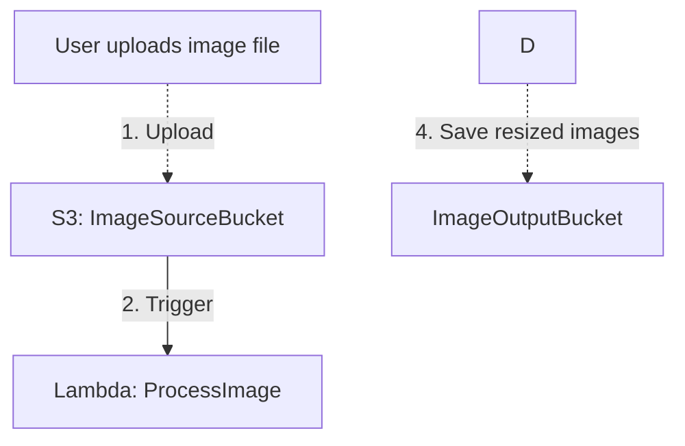

# Initial Project

The repository is bootstrapped with the Atlantis Starter 00 (Basic API Gateway with Lambda Function Written in Node.js) Please review the structure and utilize the `atlantis` mcp to understand the application and the Atlantis platform templates, patterns, and scripts.

We will be creating a Serverless Image Resizer application which will use Node.js and the `sharp` NPM package to provide event driven serverless image resizing.

- This stack will be independent of the S3 buckets it saves images to.
- This stack will provide an S3 bucket `source` for uploading images
- This stack is not concerned with how the images are uploaded, or the mechinism by which they are uploaded.
- It is assumed an external process uploads the images to S3 for processing.
- When an image is uploaded to S3 an S3 Event triggers the Lambda function
- The S3 Event will replace the use of API Gateway in the application's template.yml
- Based on the object tag `ImageOutputBucket` of the uploaded image, it will be saved to the specified bucket
- Based on the object tag `StageId` of the uploaded image, it will be saved to that stageId in the bucket (when stageId is a placeholder)
- Based on the object tag `ImageOutputPath` of the uploaded image, it will be saved to the specified `ImageOutputBasePrefix+ImageOutputPath`



Since this application will be provided access to multiple S3 buckets to save images to, we need to provide least privilage access. However, since we want to allow dynamic access we can't provide a list of buckets for a Lambda Execution Role.

The Lambda function itself will need to check the tags of the output bucket and determine if it is allowed to save there and where to save objects.

Users will be instructed to provide two tags for the bucket `AllowImageResizerEvents` and `imageResizer:ImageOutputBasePrefix`

```bash
aws s3api put-bucket-tagging \
  --bucket your-bucket-name \
  --tagging 'TagSet=[
    {Key=AllowImageResizerEvents,Value=true},
    {Key=imageResizer:ImageOutputBasePrefix,Value="/web/@stageId/public/img"}
  ]'
```

Before an object is resized, the bucket tags should be retreived and checked. Bucket information should also be stored using an in memory cache in Lambda. While this won't help with concurrent executions, it should assist with subsequent executions against the same bucket.

If `AllowImageResizerEvents` is does not exist or is set to any value but `true` then the Lambda function should ignore the event.

`ImageOutputBasePrefix` will provide the lambda function with the base path/prefix. If this tag does not exist, then the application stack parameter `ImageOutputPrefix` will be used. `/{stageId}/public/images` is the default value.

The parameter `ImageOutputBasePrefix` will be defined as the following in template.yml:

```yaml
  ImageOutputBasePrefix:
    Type: String
    Description: "S3 object prefix for outputs. Use {stageId} as placeholder for stage identifiers (prod, beta, stage, dev, test). Must start with / and not end with / (except for root /). Examples: /{stageId}/public (default), /public, /{stageId}/assets, /content/{stageId}/public, /"
    Default: "/{stageId}/public/images"
    AllowedPattern: "^$|^/|/([a-zA-Z0-9\\-_]+|\\{stageId\\})(/([a-zA-Z0-9\\-_]+|\\{stageId\\}))*$"
    ConstraintDescription: "Must be empty (uses default), start with /, not end with / (except root /), and only use {stageId} placeholder. Valid characters: a-z, A-Z, 0-9, -, _, {, }. Curly braces may only wrap the literal text 'stageId'."
```

The `stageId` placeholder is `@stageId` when used in bucket tag values (due to tag value character restrictions) and `{stageId}` when used in the template parameter.

If the bucket has an `imageResizer:ImageOutputBasePrefix` tag that contains a stageId placeholder, but no stageId is provided in the object tag then the request should be ignored. This should occur when the bucket tags are checked.

If the bucket does not have a stageId placeholder then the `stageId` tag from the object is ignored.

The Lambda function should check for the existence of environment variables for various settings. Settings should not be hard coded. There should be a settings.js file.

Try to organize the lambda function directory structure:

- config/settings.js
- handler.js
- utils/

The image resizer will maintain the proportions of the image.
Images will be output in the following sizes according to the long side of the image (as set in the settings.js):

xxLarge: 3000
xLarge: 1920
large: 1000
medium: 800
small: 500
thumb: 250

Each image will be stored in it's own path:
```
<imageOutputBasePrefix>/<originalName>/xx-large.jpg
<imageOutputBasePrefix>/<originalName>/x-large.jpg
<imageOutputBasePrefix>/<originalName>/large.jpg
<imageOutputBasePrefix>/<originalName>/medium.jpg
<imageOutputBasePrefix>/<originalName>/small.jpg
<imageOutputBasePrefix>/<originalName>/thumb.jpg
<imageOutputBasePrefix>/<originalName>/details.json
```

Note: the file extension is retained. It will remain .jpg, .png, etc based upon original upload

If an object is uploaded to: `uploads/doghouselights/xyz/myImage.jpg`
With tags: 
ImageOutputPath=posts/2026-05-09
ImageOutputBucket=my-image-bucket
stageId=prod

And my-image-bucket has the following tags:
AllowImageResizerEvents=true,
imageResizer:ImageOutputBasePrefix=/web/@stageId/public/img

Then the following will be created:
```
s3://my-image-bucket/web/prod/public/img/posts/2026-05-09/myImage/xx-large.jpg
s3://my-image-bucket/web/prod/public/img/posts/2026-05-09/myImage/x-large.jpg
s3://my-image-bucket/web/prod/public/img/posts/2026-05-09/myImage/large.jpg
s3://my-image-bucket/web/prod/public/img/posts/2026-05-09/myImage/medium.jpg
s3://my-image-bucket/web/prod/public/img/posts/2026-05-09/myImage/small.jpg
s3://my-image-bucket/web/prod/public/img/posts/2026-05-09/myImage/thumb.jpg
s3://my-image-bucket/web/prod/public/img/posts/2026-05-09/myImage/metadata.json
```

The meta.json file will include the following information:

```json
{
    "type": "jpg",
    "lastModified": "YYYY-MM-DDTHH:MM:SSZ",
    "created": "YYYY-MM-DDTHH:MM:SSZ",
    "exif": {},
    "locationName": "",
    "locationCoord": {lat: "", long: ""},
    "defaultDescription": "<fromExifData>",
    "defaultLongDescription": "",
    "defaultAltText": "",
    "defaultCaption": "",
    "credit": "",
    "copyright": "",
    "dateTaken": "YYYY-MM-DDTHH:MM:SSZ",
    "sizes": {
        "xxLarge": [w, h],
        "xLarge": [w, h],
        "large": [w, h],
        "small": [w, h],
        "thumb": [w, h]
    }
}
```

The metadata file will be generated/updated:
- when myImage.json is uploaded to source bucket with information (overrides image data except `sizes`)
- if no myImage.json exists then image exif data is used
- if `<imageName>/metadata.json` already exists, and a `imagename.json` file is uploaded, then supplied values are used.

The imagename.json file can be uploaded at any time to update the json file.
A new image replacing the old image may also be uploaded at any time (replace old)

An uploaded json file does not need to be complete. Only information to update needs to be supplied. If a field needs to be removed or cleared out, a null value should be supplied. The generated metadata.json file should always contain all the first level property fields with no null values. Use empty values. `{}`, `[]`, `""`. If a null is supplied by an uploaded json file then an empty value should be used.

All size properties should be listed, even if they are empty.
If an image is uploaded with exif data, it should replace existing exif data, but no other non-empty data.

Originals retained based on a specified lifecycle date. (set in the s3 definition in template.yml, and the retention date is specified as a template parameter (one for PROD one for Non-prod, default is PROD: 5 days, non-prod: 1 days)). Check atlantis cloudformation template for storage cache-data for example implementation. The environment PROD vs Non-Prod is for the deployment of this application, not related to the stageId of the image uploaded. If retention is set to 0 then no lifecycle policy is created, the originals are kept indefinately.

Anything uploaded to the uploads directory on the source bucket is used as an event trigger. The path after `uploads` is ignored except for the file name itself. (the client can organize the files however they wish based upon their batch operations) Only the ImageOutputBucket and ImageOutputPath (and the bucket's imageResizer:ImageOutputBasePrefix) dictate where the image is stored.

Be sure to follow Atlantis best practices, template patterns, and design. For troubleshooting, log decisions, but do not over log (AWS SDK client response, etc).

Use the Jest testing framework.
If supporting deployment scripts are required, use python (preferred) or bash first.
This will utilize the Atlantis pipeline template-pipeline.yml for deployments. Be sure the buildspec is properly structured to utilize tests.
Do not provide instructions for deployments outside of the pipeline.
We will most likely not need the @63klabs/cache-data npm package, but if it would simplify SDK access we can use it as it works nicely with Atlantis bootstrapped applications.

Ask any clarifying questions in SPEC-QUESTIONS.md and the user will answer them there. Only after the questions are answered and reviewed in SPEC-QUESTIONS.md, should we move on to the requirements phase.
