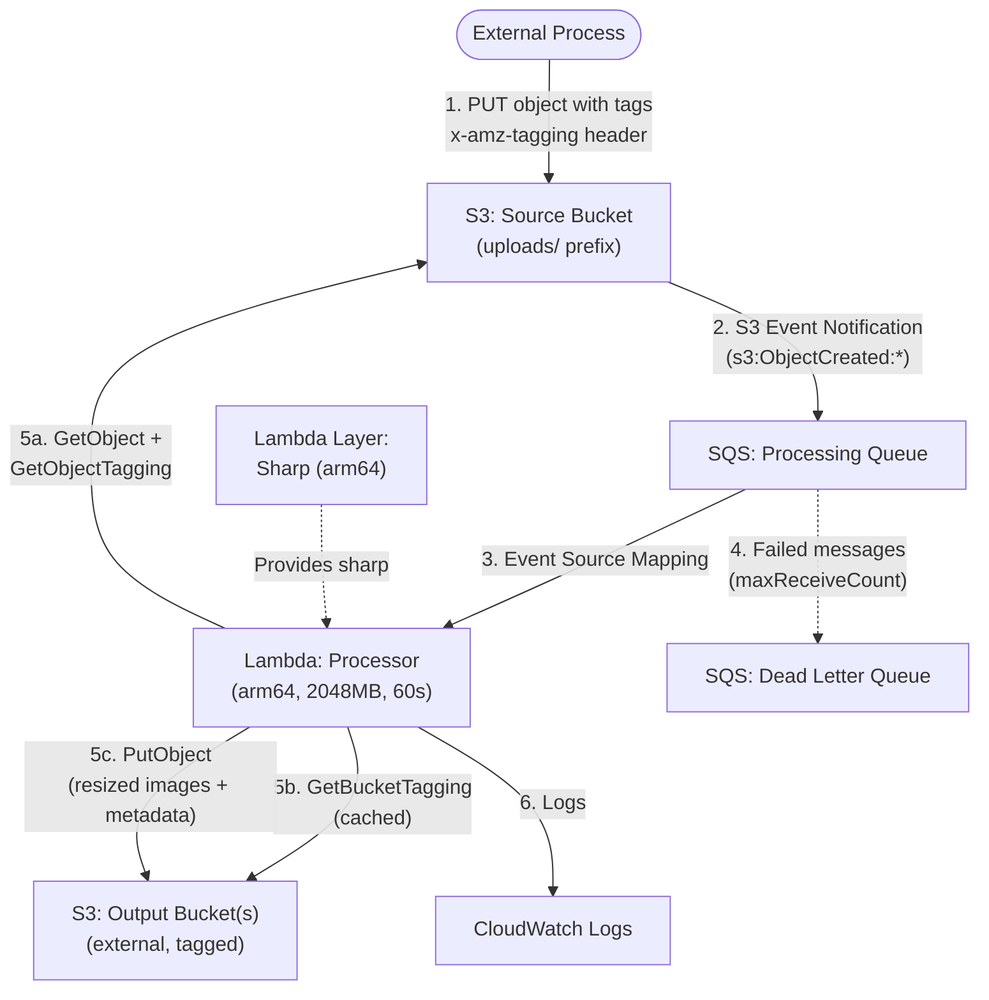

# Design Document: Serverless Image Resizer

## Overview

This design replaces the Atlantis Starter 00 (API Gateway + Lambda) with an event-driven image processing pipeline. Images uploaded to a source S3 bucket are queued via SQS and processed by a single Lambda function that resizes images using Sharp, generates WebP variants, extracts EXIF metadata, and writes outputs to dynamically determined destination buckets based on object and bucket tags.

The architecture follows the Atlantis platform conventions for naming, IAM, deployment, and CloudFormation/SAM templating. The existing API Gateway resources are removed entirely.



## Architecture

### High-Level Data Flow

1. An external process uploads an image or JSON file to `s3://<source-bucket>/uploads/...` with object tags (`ImageOutputBucket`, `ImageOutputPath`, `stageId`).
2. The source bucket sends an S3 event notification (filtered to `uploads/` prefix) to the Processing Queue (standard SQS).
3. The Lambda function is triggered by the SQS event source mapping.
4. For each SQS record, the Lambda:
   - Retrieves the object and its tags from the source bucket.
   - Validates the `ImageOutputBucket` tag (required).
   - Retrieves and caches the output bucket's tags (`AllowImageResizerEvents`, `imageResizer:ImageOutputBasePrefix`).
   - Validates authorization (`AllowImageResizerEvents=true`).
   - Resolves the output path using bucket tags, object tags, and stack parameters.
   - If the object is an image: resizes into up to 6 size tiers, optionally creates WebP variants, extracts EXIF, generates `metadata.json`, and writes all outputs to the destination bucket.
   - If the object is a JSON file: merges the uploaded JSON into the existing `metadata.json` in the destination bucket.
5. Failed messages are retried by SQS visibility timeout and eventually moved to the Dead Letter Queue.

### Key Design Decisions

| Decision | Rationale |
|----------|-----------|
| Single Lambda with SQS event source (not 2-Lambda model) | No batching/consolidation benefit for independent image processing. SQS provides retry, DLQ, and backpressure natively. Simpler to debug and maintain. |
| Sharp as Lambda Layer (arm64 only) | Separates native binary from application code. Layer is built during CodeBuild with `--arch=arm64 --platform=linux`. Reduces deployment package size. |
| In-memory bucket tag cache (module-level variable) | Persists across warm Lambda invocations within the same execution environment. Reduces `GetBucketTagging` API calls. Does not help concurrent executions but assists sequential ones. |
| Object tags drive routing | Decouples the image resizer from any specific destination. The uploader controls where images land. |
| Bucket tags drive authorization | `AllowImageResizerEvents=true` acts as an opt-in gate. Cannot use IAM condition policies on bucket tags, so runtime verification is required. |
| `@stageId` in bucket tags, `{stageId}` in template parameter | S3 tag values have character restrictions that prevent curly braces. The template parameter uses `{stageId}` for CloudFormation consistency. |
| No upscaling | If the original is smaller than a size tier threshold, save at original dimensions for that tier and skip all larger tiers. Prevents quality degradation. |
| WebP alongside originals | Same directory, same filename stem, `.webp` extension. Simplifies consumer logic. |
| `metadata.json` with no null values | All fields always present. Empty values use `""`, `{}`, `[]`. Consumers can rely on consistent schema. |
| `context.getRemainingTimeInMillis()` for timeout awareness | More reliable than an environment variable. Allows graceful handling if processing approaches the timeout. |
| Jest for testing | Per project conventions. All new tests in Jest. |
| Python for deployment scripts | Per AGENTS.md and existing build-scripts convention. |

### Directory Structure (New)

```
application-infrastructure/
├── build-scripts/                          # Existing Python build scripts (unchanged)
│   ├── generate-put-ssm.py
│   ├── update_template_configuration.py
│   └── update_template_timestamp.py
├── src/
│   └── lambda/
│       ├── functions/
│       │   └── processor/
│       │       ├── handler.js              # SQS event handler entry point
│       │       ├── package.json            # Lambda function dependencies (excl. sharp)
│       │       ├── config/
│       │       │   └── settings.js         # Centralized configuration from env vars
│       │       └── utils/
│       │           ├── s3Client.js         # S3 GetObject, PutObject, GetObjectTagging, GetBucketTagging
│       │           ├── imageProcessor.js   # Sharp resize + WebP conversion
│       │           ├── metadataManager.js  # metadata.json generation, merge, EXIF extraction
│       │           ├── bucketTagCache.js   # In-memory cache for bucket tag lookups
│       │           ├── pathResolver.js     # Output path resolution with placeholder substitution
│       │           └── logger.js           # Configurable structured logging
│       └── layers/
│           └── sharp-arm64/
│               └── nodejs/
│                   └── package.json        # Sharp dependency only
├── buildspec.yml                           # Updated: test → build layer → SAM package
├── template.yml                            # Updated: S3 + SQS + Lambda (no API Gateway)
└── template-configuration.json             # Updated: remove ApiPathBase, ApiGatewayLoggingEnabled
```


## Components and Interfaces

### 1. CloudFormation Template (`template.yml`)

#### Resources Removed

- `WebApi` (AWS::Serverless::Api)
- `ApiGatewayAccessLogGroup` (AWS::Logs::LogGroup)
- `ApiGatewayExecutionLogGroup` (AWS::Logs::LogGroup)
- `ConfigLambdaPermission` (AWS::Lambda::Permission)
- `ConfigLambdaPermissionLive` (AWS::Lambda::Permission)

#### Parameters Removed

- `ApiPathBase`
- `ApiGatewayLoggingEnabled`

#### Parameters Added

| Parameter | Type | Default | Description |
|-----------|------|---------|-------------|
| `CreateWebpVersion` | String | `true` | AllowedValues: `true`, `false`. Passed as `CREATE_WEBP_VERSION` env var. |
| `ImageOutputBasePrefix` | String | `/{stageId}/public/images` | S3 object prefix for outputs. Uses `{stageId}` placeholder. AllowedPattern validates format. |
| `MaxImageFileSize` | Number | `26214400` (25MB) | Maximum image file size in bytes. Passed as `MAX_IMAGE_FILE_SIZE` env var. |
| `SourceBucketRetentionInDaysForPROD` | Number | `5` | Retention days for uploads/ prefix in PROD. 0 = archive mode. |
| `SourceBucketRetentionInDaysForDEVTEST` | Number | `1` | Retention days for uploads/ prefix in DEV/TEST. 0 = archive mode. |

#### Parameters Modified

| Parameter | Change |
|-----------|--------|
| `FunctionTimeOutInSeconds` | Default: `60`, MaxValue: `900` (no API Gateway constraint) |
| `FunctionMaxMemoryInMB` | Default: `2048` |
| `FunctionArchitecture` | Hardcoded to `arm64` (remove parameter, use direct value) |

#### New Resources

##### SourceBucket (AWS::S3::Bucket)

```yaml
SourceBucket:
  Type: AWS::S3::Bucket
  DeletionPolicy: !If [IsProduction, Retain, Delete]
  UpdateReplacePolicy: Retain
  Properties:
    BucketName: !If
      - UseS3BucketNameOrgPrefix
      - !Sub '${S3BucketNameOrgPrefix}-${Prefix}-${ProjectId}-${StageId}-${AWS::AccountId}-${AWS::Region}-an'
      - !Sub '${Prefix}-${ProjectId}-${StageId}-${AWS::AccountId}-${AWS::Region}-an'
    BucketNamespace: "account-regional"
    VersioningConfiguration: !If
      - SourceBucketArchiveMode
      - Status: Enabled
      - !Ref 'AWS::NoValue'
    NotificationConfiguration:
      QueueConfigurations:
        - Event: 's3:ObjectCreated:*'
          Queue: !GetAtt ProcessingQueue.Arn
          Filter:
            S3Key:
              Rules:
                - Name: prefix
                  Value: 'uploads/'
    LifecycleConfiguration:
      Rules: !If
        - SourceBucketArchiveMode
        - - Id: ArchiveUploads
            Status: Enabled
            Prefix: 'uploads/'
            Transitions:
              - StorageClass: DEEP_ARCHIVE
                TransitionInDays: 30
            NoncurrentVersionExpiration:
              NoncurrentDays: 30
        - - Id: ExpireUploads
            Status: Enabled
            Prefix: 'uploads/'
            ExpirationInDays: !If
              - IsProduction
              - !Ref SourceBucketRetentionInDaysForPROD
              - !Ref SourceBucketRetentionInDaysForDEVTEST
```

##### ProcessingQueue (AWS::SQS::Queue)

```yaml
ProcessingQueue:
  Type: AWS::SQS::Queue
  Properties:
    QueueName: !Sub '${Prefix}-${ProjectId}-${StageId}-ProcessingQueue'
    VisibilityTimeout: 360  # 6x Lambda timeout (60s)
    RedrivePolicy:
      deadLetterTargetArn: !GetAtt DeadLetterQueue.Arn
      maxReceiveCount: 3
```

##### DeadLetterQueue (AWS::SQS::Queue)

```yaml
DeadLetterQueue:
  Type: AWS::SQS::Queue
  Properties:
    QueueName: !Sub '${Prefix}-${ProjectId}-${StageId}-Dlq'
    MessageRetentionPeriod: 1209600  # 14 days
```

##### ProcessingQueuePolicy (AWS::SQS::QueuePolicy)

Allows the source bucket to send messages to the processing queue:

```yaml
ProcessingQueuePolicy:
  Type: AWS::SQS::QueuePolicy
  Properties:
    Queues:
      - !Ref ProcessingQueue
    PolicyDocument:
      Statement:
        - Effect: Allow
          Principal:
            Service: s3.amazonaws.com
          Action: sqs:SendMessage
          Resource: !GetAtt ProcessingQueue.Arn
          Condition:
            ArnLike:
              aws:SourceArn: !GetAtt SourceBucket.Arn
```

##### SharpLayer (AWS::Serverless::LayerVersion)

```yaml
SharpLayer:
  Type: AWS::Serverless::LayerVersion
  Properties:
    LayerName: !Sub '${Prefix}-${ProjectId}-${StageId}-SharpArm64'
    ContentUri: src/lambda/layers/sharp-arm64/
    CompatibleRuntimes:
      - nodejs24.x
    CompatibleArchitectures:
      - arm64
```

##### ProcessorFunction (AWS::Serverless::Function) — replaces AppFunction

```yaml
ProcessorFunction:
  Type: AWS::Serverless::Function
  Properties:
    FunctionName: !Sub '${Prefix}-${ProjectId}-${StageId}-Processor'
    Description: "Processes uploaded images: resize, WebP conversion, metadata generation"
    Role: !GetAtt LambdaExecutionRole.Arn
    CodeUri: src/lambda/functions/processor/
    Handler: handler.handler
    Runtime: nodejs24.x
    Architectures:
      - arm64
    Timeout: !Ref FunctionTimeOutInSeconds
    MemorySize: !Ref FunctionMaxMemoryInMB
    Layers:
      - !Ref SharpLayer
    Environment:
      Variables:
        NODE_ENV: !If [IsProduction, "production", "development"]
        DEPLOY_ENVIRONMENT: !Ref DeployEnvironment
        LOG_LEVEL: !If [IsProduction, "0", "5"]
        CREATE_WEBP_VERSION: !Ref CreateWebpVersion
        IMAGE_OUTPUT_BASE_PREFIX: !Ref ImageOutputBasePrefix
        MAX_IMAGE_FILE_SIZE: !Ref MaxImageFileSize
        SOURCE_BUCKET: !Ref SourceBucket
        STAGE_ID: !Ref StageId
    Events:
      SqsEvent:
        Type: SQS
        Properties:
          Queue: !GetAtt ProcessingQueue.Arn
          BatchSize: 1
          FunctionResponseTypes:
            - ReportBatchItemFailures
```

#### Conditions Added

```yaml
Conditions:
  UseS3BucketNameOrgPrefix: !Not [!Equals [!Ref S3BucketNameOrgPrefix, ""]]
  SourceBucketArchiveMode: !If
    - IsProduction
    - !Equals [!Ref SourceBucketRetentionInDaysForPROD, 0]
    - !Equals [!Ref SourceBucketRetentionInDaysForDEVTEST, 0]
```

#### IAM Policy (LambdaExecutionRole)

```yaml
Policies:
  - PolicyName: !Sub "${Prefix}-${ProjectId}-${StageId}-ExecutionPolicy"
    PolicyDocument:
      Statement:
        - Sid: LambdaAccessToWriteLogs
          Effect: Allow
          Action:
            - logs:CreateLogGroup
            - logs:CreateLogStream
            - logs:PutLogEvents
          Resource: !GetAtt AppLogGroup.Arn

        - Sid: ReadSourceBucket
          Effect: Allow
          Action:
            - s3:GetObject
            - s3:GetObjectTagging
          Resource: !Sub '${SourceBucket.Arn}/*'

        - Sid: WriteToOutputBuckets
          Effect: Allow
          Action:
            - s3:PutObject
          Resource: 'arn:aws:s3:::*'

        - Sid: ReadBucketTags
          Effect: Allow
          Action:
            - s3:GetBucketTagging
          Resource: 'arn:aws:s3:::*'

        - Sid: SqsConsume
          Effect: Allow
          Action:
            - sqs:ReceiveMessage
            - sqs:DeleteMessage
            - sqs:GetQueueAttributes
          Resource: !GetAtt ProcessingQueue.Arn
```

> **Note on wildcards**: `s3:PutObject` and `s3:GetBucketTagging` use wildcard resources because output buckets are determined dynamically at runtime. Authorization is enforced by the Lambda checking `AllowImageResizerEvents=true` on the target bucket before writing. This is documented in Requirements 11.1–11.4.

### 2. Lambda Handler (`handler.js`)

```
handler(event, context)
  ├── For each record in event.Records:
  │   ├── Parse S3 event from SQS message body
  │   ├── Get object tags (ImageOutputBucket, ImageOutputPath, stageId)
  │   ├── Validate ImageOutputBucket tag exists
  │   ├── Get/cache bucket tags (AllowImageResizerEvents, imageResizer:ImageOutputBasePrefix)
  │   ├── Validate AllowImageResizerEvents === 'true'
  │   ├── Resolve output base prefix (placeholder substitution)
  │   ├── Check file size against MAX_IMAGE_FILE_SIZE
  │   ├── Branch on file extension:
  │   │   ├── Image (.jpg, .png, .gif, etc.): processImage()
  │   │   └── JSON (.json): processJsonMetadata()
  │   └── Check context.getRemainingTimeInMillis() for timeout awareness
  └── Return batchItemFailures for partial batch failure reporting
```

### 3. Settings Module (`config/settings.js`)

Exports a frozen configuration object built from environment variables with fallback defaults:

| Setting | Env Var | Default |
|---------|---------|---------|
| `sizes.xxLarge` | — | `3000` |
| `sizes.xLarge` | — | `1920` |
| `sizes.large` | — | `1000` |
| `sizes.medium` | — | `800` |
| `sizes.small` | — | `500` |
| `sizes.thumb` | — | `250` |
| `createWebpVersion` | `CREATE_WEBP_VERSION` | `true` |
| `imageOutputBasePrefix` | `IMAGE_OUTPUT_BASE_PREFIX` | `/{stageId}/public/images` |
| `maxImageFileSize` | `MAX_IMAGE_FILE_SIZE` | `26214400` (25MB) |
| `logLevel` | `LOG_LEVEL` | `0` |
| `stageId` | `STAGE_ID` | `''` |
| `sourceBucket` | `SOURCE_BUCKET` | `''` |

### 4. Utility Modules

#### `utils/s3Client.js`

Wraps AWS SDK v3 S3 client operations:

- `getObject(bucket, key)` → `{ Body, ContentLength, ContentType }`
- `getObjectTagging(bucket, key)` → `{ TagSet: [{Key, Value}] }`
- `getBucketTagging(bucket)` → `{ TagSet: [{Key, Value}] }`
- `putObject(bucket, key, body, contentType)` → void

Uses the AWS SDK already available in the Lambda runtime (no bundling).

#### `utils/imageProcessor.js`

- `resizeImage(imageBuffer, originalFormat, sizes, createWebp)` → `{ resizedImages: [{sizeName, buffer, width, height, format}], webpImages: [{sizeName, buffer, width, height}] }`
- Determines the long side of the original image.
- Iterates size tiers from smallest to largest. For each tier:
  - If original long side >= tier threshold: resize proportionally.
  - If original long side < tier threshold: save at original dimensions for this tier, skip all larger tiers.
- If `createWebp` is true, creates a `.webp` variant for each resized image.

#### `utils/metadataManager.js`

- `generateMetadata(exifData, sizes, hasWebp, originalFormat)` → metadata object
- `mergeMetadata(existingMetadata, uploadedJson)` → merged metadata object
- `extractExif(imageBuffer)` → raw EXIF object
- Ensures no null values in output (replaces with `""`, `{}`, `[]`).
- Populates `credit` from EXIF `Artist` if `credit` is empty.
- On image re-upload: replaces EXIF data but preserves non-empty descriptive fields.
- On JSON upload: overwrites provided fields, converts null to empty values, preserves `sizes`/`exif`/`hasWebp` unless explicitly provided.

#### `utils/bucketTagCache.js`

- Module-level `Map` variable that persists across warm invocations.
- `getCachedTags(bucketName)` → cached tag object or `null`
- `setCachedTags(bucketName, tags)` → void
- No TTL (cache lives for the duration of the Lambda execution environment).

#### `utils/pathResolver.js`

- `resolveOutputPath(bucketBasePrefix, stackBasePrefix, objectTags, stageId)` → resolved full prefix string
- Replaces `@stageId` in bucket tag value or `{stageId}` in stack parameter value with actual stageId.
- Constructs: `<resolvedBasePrefix>/<ImageOutputPath>/<originalFileName>/`
- If `ImageOutputPath` is absent, uses empty string for that segment.

#### `utils/logger.js`

- Configurable log level from `LOG_LEVEL` environment variable.
- Methods: `error()`, `warn()`, `info()`, `debug()`, `trace()`
- Structured JSON output for CloudWatch.
- Does not log full AWS SDK responses (per Requirement 14.2).

### 5. Sharp Lambda Layer

Located at `src/lambda/layers/sharp-arm64/nodejs/package.json`:

```json
{
  "name": "sharp-arm64-layer",
  "version": "1.0.0",
  "description": "Sharp image processing library for arm64 Lambda",
  "dependencies": {
    "sharp": "^0.33.0"
  }
}
```

Built during CodeBuild with:
```bash
cd src/lambda/layers/sharp-arm64/nodejs
npm install --arch=arm64 --platform=linux
```

### 6. Buildspec (`buildspec.yml`)

Updated phases:

```yaml
phases:
  install:
    runtime-versions:
      nodejs: latest
      python: latest
    commands:
      - python3 --version
      - node --version
      - aws --version
      - npm config -g set prefer-offline true
      - npm config -g set cache /root/.npm
      - |
        if [ -f "build-scripts/requirements.txt" ]; then
          pip install -r build-scripts/requirements.txt
        fi

  pre_build:
    commands:
      # Install Lambda function dependencies
      - cd application-infrastructure/src/lambda/functions/processor
      - npm install --production
      - npm audit fix --force
      - npm audit --audit-level=high
      - cd ../../../../..

      # Build Sharp layer (arm64/linux)
      - cd application-infrastructure/src/lambda/layers/sharp-arm64/nodejs
      - npm install --arch=arm64 --platform=linux
      - cd ../../../../../..

      # Run tests
      - cd application-infrastructure
      - npm run test --if-present
      - cd ..

      # SSM parameter setup
      - cd application-infrastructure
      - python3 ./build-scripts/generate-put-ssm.py ${PARAM_STORE_HIERARCHY}ExampleParameter

  build:
    commands:
      - python3 ./build-scripts/update_template_timestamp.py template.yml
      - python3 ./build-scripts/update_template_configuration.py template-configuration.json
      - aws cloudformation package --template template.yml --s3-bucket $S3_ARTIFACTS_BUCKET --output-template template-export.yml
```

### 7. Documentation Structure

| Directory | Audience | Content |
|-----------|----------|---------|
| `docs/end-user/` | Client developers integrating with the image resizer | Upload guide with `x-amz-tagging` header format, AWS CLI examples for image and JSON uploads, bucket tag setup instructions, supported formats, size tiers |
| `docs/admin-ops/` | System operators, cloud engineers | Error log monitoring with CloudWatch log filter patterns, DLQ inspection commands, CloudWatch metrics, alarm configuration, source bucket lifecycle management |
| `docs/developer/` | Application developers and maintainers | Architecture overview, local development setup, testing guide, module documentation, deployment via Atlantis pipeline |


## Data Models

### Object Tags (on uploaded S3 objects)

| Tag Key | Required | Description |
|---------|----------|-------------|
| `ImageOutputBucket` | Yes | Name of the destination S3 bucket |
| `ImageOutputPath` | No | Path segment after the base prefix (e.g., `posts/2026-05-09`) |
| `stageId` | Conditional | Required only if the output base prefix contains a `@stageId` or `{stageId}` placeholder |

### Bucket Tags (on destination S3 buckets)

| Tag Key | Required | Description |
|---------|----------|-------------|
| `AllowImageResizerEvents` | Yes | Must be `true` to authorize writes |
| `imageResizer:ImageOutputBasePrefix` | No | Base prefix with optional `@stageId` placeholder. Falls back to stack parameter if absent. |

### metadata.json Schema

```json
{
  "type": "jpg",
  "lastModified": "2026-05-09T12:00:00Z",
  "created": "2026-05-09T12:00:00Z",
  "exif": {},
  "locationName": "",
  "locationCoord": { "lat": "", "long": "" },
  "defaultDescription": "",
  "defaultLongDescription": "",
  "defaultAltText": "",
  "defaultCaption": "",
  "credit": "",
  "copyright": "",
  "dateTaken": "",
  "hasWebp": true,
  "sizes": {
    "xxLarge": [3000, 2000],
    "xLarge": [1920, 1280],
    "large": [1000, 667],
    "medium": [800, 533],
    "small": [500, 333],
    "thumb": [250, 167]
  }
}
```

Field rules:
- No null values. Use `""` for strings, `{}` for objects, `[]` for arrays.
- `sizes`: All six tiers always present. Skipped tiers use `[]`.
- `exif`: Raw dump of all EXIF data from Sharp/EXIF parser.
- `credit`: Populated from EXIF `Artist` tag if empty.
- `hasWebp`: `true` when WebP variants were generated, `false` otherwise.
- `type`: Original file extension without dot (e.g., `jpg`, `png`, `gif`).

### Output Path Structure

For an image uploaded to `uploads/batch1/myImage.jpg` with tags:
- `ImageOutputBucket=my-bucket`
- `ImageOutputPath=posts/2026-05-09`
- `stageId=prod`

And bucket tag `imageResizer:ImageOutputBasePrefix=/web/@stageId/public/img`:

```
s3://my-bucket/web/prod/public/img/posts/2026-05-09/myImage/xxLarge.jpg
s3://my-bucket/web/prod/public/img/posts/2026-05-09/myImage/xxLarge.webp
s3://my-bucket/web/prod/public/img/posts/2026-05-09/myImage/xLarge.jpg
s3://my-bucket/web/prod/public/img/posts/2026-05-09/myImage/xLarge.webp
s3://my-bucket/web/prod/public/img/posts/2026-05-09/myImage/large.jpg
s3://my-bucket/web/prod/public/img/posts/2026-05-09/myImage/large.webp
s3://my-bucket/web/prod/public/img/posts/2026-05-09/myImage/medium.jpg
s3://my-bucket/web/prod/public/img/posts/2026-05-09/myImage/medium.webp
s3://my-bucket/web/prod/public/img/posts/2026-05-09/myImage/small.jpg
s3://my-bucket/web/prod/public/img/posts/2026-05-09/myImage/small.webp
s3://my-bucket/web/prod/public/img/posts/2026-05-09/myImage/thumb.jpg
s3://my-bucket/web/prod/public/img/posts/2026-05-09/myImage/thumb.webp
s3://my-bucket/web/prod/public/img/posts/2026-05-09/myImage/metadata.json
```

### Settings Module Data Model

```javascript
{
  sizes: {
    xxLarge: 3000,
    xLarge: 1920,
    large: 1000,
    medium: 800,
    small: 500,
    thumb: 250
  },
  createWebpVersion: true,
  imageOutputBasePrefix: '/{stageId}/public/images',
  maxImageFileSize: 26214400,
  logLevel: 0,
  stageId: '',
  sourceBucket: ''
}
```

### SQS Message Structure (from S3 Event Notification)

The Lambda receives SQS events where each record's `body` is a JSON string containing the S3 event notification:

```json
{
  "Records": [
    {
      "eventSource": "aws:s3",
      "eventName": "ObjectCreated:Put",
      "s3": {
        "bucket": { "name": "source-bucket-name" },
        "object": {
          "key": "uploads/batch1/myImage.jpg",
          "size": 2048576
        }
      }
    }
  ]
}
```


## Correctness Properties

*A property is a characteristic or behavior that should hold true across all valid executions of a system — essentially, a formal statement about what the system should do. Properties serve as the bridge between human-readable specifications and machine-verifiable correctness guarantees.*

### Property 1: Bucket authorization rejects non-true values

*For any* string value of the `AllowImageResizerEvents` bucket tag that is not exactly `"true"` (including missing, empty, `"True"`, `"TRUE"`, `"yes"`, `"1"`, or any random string), the Processor Lambda SHALL ignore the event and not write any objects to that bucket.

**Validates: Requirements 2.4, 11.4**

### Property 2: Image resize tier selection and skip logic

*For any* image with dimensions (width, height) and the predefined size tiers (xxLarge=3000, xLarge=1920, large=1000, medium=800, small=500, thumb=250), when the image is resized:
- For each tier where the original long side >= tier threshold, the resized image long side SHALL equal the tier threshold.
- For the first tier where the original long side < tier threshold, the resized image SHALL be saved at original dimensions.
- All tiers larger than that first "too large" tier SHALL be skipped (empty arrays in metadata sizes).

**Validates: Requirements 3.1, 3.3**

### Property 3: Aspect ratio preservation

*For any* image with dimensions (width, height) and any size tier, the aspect ratio of the resized image (width/height) SHALL equal the aspect ratio of the original image within a tolerance of ±1 pixel (due to integer rounding).

**Validates: Requirements 3.2**

### Property 4: Output format retention

*For any* supported image format (jpg, png, gif), the resized output SHALL retain the same file format and extension as the original input.

**Validates: Requirements 3.4**

### Property 5: Output path resolution with placeholder substitution

*For any* combination of:
- A bucket base prefix (with or without `@stageId` placeholder)
- A stack parameter base prefix (with or without `{stageId}` placeholder)
- An `ImageOutputPath` value (present or absent)
- A `stageId` value (present or absent)
- An original file name and extension

The resolved output path SHALL:
- Replace `@stageId` in bucket tag values with the actual stageId
- Replace `{stageId}` in stack parameter values with the actual stageId
- Ignore the stageId tag when no placeholder exists in the base prefix
- Construct the path as `<resolvedBasePrefix>/<ImageOutputPath>/<originalFileName>/<sizeName>.<extension>`
- Use an empty string for ImageOutputPath when the tag is absent (no double slashes)

**Validates: Requirements 2.6, 3.6, 7.1, 7.2, 7.3**

### Property 6: Metadata schema completeness and no-null invariant

*For any* generated metadata.json output (whether from image processing or JSON merge), the output SHALL:
- Contain all required top-level fields: `type`, `lastModified`, `created`, `exif`, `locationName`, `locationCoord`, `defaultDescription`, `defaultLongDescription`, `defaultAltText`, `defaultCaption`, `credit`, `copyright`, `dateTaken`, `hasWebp`, `sizes`
- Contain all six size tiers in the `sizes` object: `xxLarge`, `xLarge`, `large`, `medium`, `small`, `thumb`
- Contain no null values at any depth; all empty fields use `""`, `{}`, or `[]`

**Validates: Requirements 5.2, 5.5, 5.6**

### Property 7: Credit populated from EXIF Artist

*For any* EXIF data containing an `Artist` tag with a non-empty value, when the `credit` field in the metadata is empty, the output metadata `credit` field SHALL equal the EXIF `Artist` value.

**Validates: Requirements 5.4**

### Property 8: JSON metadata merge with null-to-empty conversion

*For any* existing metadata.json and any uploaded JSON update:
- Fields present in the uploaded JSON with non-null values SHALL overwrite the corresponding fields in the existing metadata.
- Fields present in the uploaded JSON with null values SHALL be replaced with the appropriate empty value (`""`, `{}`, `[]`) in the output metadata.
- The output metadata SHALL contain no null values.

**Validates: Requirements 6.3, 6.4**

### Property 9: JSON merge preserves protected fields

*For any* JSON metadata upload that does not explicitly include `sizes`, `exif`, or `hasWebp` fields, those fields in the output metadata SHALL be identical to the values in the existing metadata before the merge.

**Validates: Requirements 6.5**

### Property 10: Image re-upload preserves non-empty descriptive fields

*For any* existing metadata with non-empty values in descriptive fields (`defaultDescription`, `defaultLongDescription`, `defaultAltText`, `defaultCaption`, `credit`, `copyright`), when a new image is uploaded and EXIF data is extracted, the output metadata SHALL:
- Replace the `exif` field with the new EXIF data.
- Preserve all non-empty descriptive field values from the existing metadata.

**Validates: Requirements 6.6**

### Property 11: Settings module environment variable resolution

*For any* combination of environment variables (`CREATE_WEBP_VERSION`, `IMAGE_OUTPUT_BASE_PREFIX`, `MAX_IMAGE_FILE_SIZE`, `LOG_LEVEL`, `STAGE_ID`, `SOURCE_BUCKET`) being set or unset:
- When an environment variable is set, the corresponding setting SHALL equal the parsed environment variable value.
- When an environment variable is not set, the corresponding setting SHALL equal the defined default value.

**Validates: Requirements 9.6, 15.2**

### Property 12: File size enforcement

*For any* image file size that exceeds the configured `maxImageFileSize` setting, the Processor Lambda SHALL reject the file without processing it.

**Validates: Requirements 10.3**


## Error Handling

### Error Categories and Responses

| Error | Source | Handler Behavior | SQS Outcome |
|-------|--------|-----------------|-------------|
| Missing `ImageOutputBucket` tag | Object tag validation | Log error with object key. Return failure for this record. | Message retried, eventually DLQ. |
| `AllowImageResizerEvents` not `true` | Bucket tag authorization | Log reason with bucket name. Return success (intentional skip, not a failure). | Message deleted (not retried). |
| `@stageId` placeholder but no `stageId` tag | Path resolution | Log error with bucket name and base prefix. Return failure. | Message retried, eventually DLQ. |
| File size exceeds `maxImageFileSize` | File size check | Log error with file size and limit. Return success (intentional rejection). | Message deleted. |
| Unsupported file type | File extension check | Log warning. Return success (skip). | Message deleted. |
| Sharp processing failure | Image resize/WebP | Log error with object key, bucket, and error message. Return failure. | Message retried, eventually DLQ. |
| S3 GetObject failure | Source bucket read | Log error with object key and error. Return failure. | Message retried, eventually DLQ. |
| S3 PutObject failure | Output bucket write | Log error with destination bucket, key, and error. Return failure. | Message retried, eventually DLQ. |
| S3 GetBucketTagging failure | Bucket tag lookup | Log error with bucket name and error. Return failure. | Message retried, eventually DLQ. |
| JSON parse error (uploaded .json) | Metadata merge | Log error with object key and parse error. Return failure. | Message retried, eventually DLQ. |
| Timeout approaching | `context.getRemainingTimeInMillis()` | Log warning. Stop processing remaining work. Return failure for unprocessed records. | Unprocessed messages retried. |

### Partial Batch Failure Reporting

The Lambda function uses `ReportBatchItemFailures` response type. When processing a batch of SQS records (even with `BatchSize: 1`, this is future-proof):

```javascript
return {
  batchItemFailures: failedRecords.map(record => ({
    itemIdentifier: record.messageId
  }))
};
```

Only failed records are returned to the queue for retry. Successfully processed records are deleted.

### Intentional Skips vs Failures

Some conditions are intentional skips (not errors):
- `AllowImageResizerEvents` not `true` → skip (the bucket opted out)
- File size exceeds limit → skip (file is too large by design)
- Unsupported file type → skip (not an image or JSON)

These return success to SQS so the message is deleted and not retried.

### Logging Strategy

All log entries include:
- `requestId` (from Lambda context)
- `sourceKey` (S3 object key being processed)
- `outputBucket` (target bucket, when known)
- `action` (what the Lambda was doing when the event occurred)

Log levels:
- `ERROR` (0): Failures that prevent processing. Always logged.
- `WARN` (1): Intentional skips, authorization failures.
- `INFO` (2): Processing decisions, sizes generated/skipped.
- `DEBUG` (3-4): Detailed flow, tag values, path resolution steps.
- `TRACE` (5): Full request/response details (excluding SDK responses per Req 14.2).

## Testing Strategy

### Testing Framework

- **Jest** for all tests (per project conventions — all new tests in Jest)
- **fast-check** for property-based testing (works with Jest)
- Minimum 100 iterations per property test

### Test Organization

```
application-infrastructure/
├── test/
│   ├── unit/
│   │   ├── settings.jest.mjs           # Settings module unit tests
│   │   ├── pathResolver.jest.mjs       # Path resolution unit tests
│   │   ├── metadataManager.jest.mjs    # Metadata generation/merge unit tests
│   │   ├── bucketTagCache.jest.mjs     # Cache behavior unit tests
│   │   ├── imageProcessor.jest.mjs     # Image resize logic unit tests
│   │   ├── logger.jest.mjs             # Logger unit tests
│   │   └── handler.jest.mjs            # Handler flow unit tests (mocked S3)
│   ├── property/
│   │   ├── pathResolver-property.jest.mjs      # Property 5: path resolution
│   │   ├── imageProcessor-property.jest.mjs    # Properties 2, 3, 4: resize logic
│   │   ├── metadataManager-property.jest.mjs   # Properties 6, 7, 8, 9, 10: metadata
│   │   ├── settings-property.jest.mjs          # Property 11: settings resolution
│   │   ├── authorization-property.jest.mjs     # Property 1: bucket authorization
│   │   └── fileSizeCheck-property.jest.mjs     # Property 12: file size enforcement
│   └── jest.config.mjs
├── package.json                        # Dev dependencies: jest, fast-check
```

### Property-Based Tests

Each correctness property maps to a property-based test using fast-check:

| Property | Test File | Generator Strategy |
|----------|-----------|-------------------|
| 1: Bucket authorization | authorization-property.jest.mjs | `fc.string()` for tag values, filter out exact `"true"` |
| 2: Resize tier selection | imageProcessor-property.jest.mjs | `fc.integer({min:1, max:10000})` for width/height |
| 3: Aspect ratio | imageProcessor-property.jest.mjs | `fc.integer({min:1, max:10000})` for width/height |
| 4: Format retention | imageProcessor-property.jest.mjs | `fc.constantFrom('jpg','png','gif')` |
| 5: Path resolution | pathResolver-property.jest.mjs | `fc.record()` with optional stageId, prefix, path components |
| 6: Metadata schema | metadataManager-property.jest.mjs | `fc.record()` with random EXIF, sizes, format |
| 7: Credit from Artist | metadataManager-property.jest.mjs | `fc.string()` for Artist, empty credit |
| 8: JSON merge | metadataManager-property.jest.mjs | `fc.record()` for existing + update with `fc.option()` for nulls |
| 9: Merge field preservation | metadataManager-property.jest.mjs | `fc.record()` for existing, update without sizes/exif/hasWebp |
| 10: Re-upload preservation | metadataManager-property.jest.mjs | `fc.record()` for existing with non-empty descriptive fields |
| 11: Settings resolution | settings-property.jest.mjs | `fc.record()` with `fc.option()` for each env var |
| 12: File size enforcement | fileSizeCheck-property.jest.mjs | `fc.integer({min: maxSize+1, max: maxSize*10})` |

Each property test is tagged with:
```javascript
// Feature: 0-0-1-initial-project, Property 1: Bucket authorization rejects non-true values
```

Configuration: minimum 100 iterations per property (`{ numRuns: 100 }`).

### Unit Tests (Example-Based)

Unit tests cover specific scenarios, edge cases, and integration points:

- **Handler flow**: Mock S3 client, verify correct sequence of calls for image and JSON uploads.
- **Tag validation**: Missing tags, empty tags, malformed tags.
- **Bucket tag cache**: First call hits S3, second call uses cache.
- **WebP toggle**: Verify webp variants generated/skipped based on setting.
- **Metadata generation**: Verify all fields present for various EXIF inputs.
- **Error scenarios**: S3 failures, Sharp failures, timeout approaching.
- **Settings defaults**: Each env var unset → correct default.

### Mocking Strategy

- AWS SDK S3 client operations are mocked in all unit and property tests.
- Sharp is mocked in handler-level tests (real Sharp used in imageProcessor tests where feasible).
- `context.getRemainingTimeInMillis()` is mocked to test timeout awareness.
- No real AWS calls in any test.

### CI/CD Integration

Tests run in the `pre_build` phase of `buildspec.yml` before SAM packaging. A test failure blocks deployment.

```yaml
pre_build:
  commands:
    - cd application-infrastructure
    - npx jest --run --ci --coverage
    - cd ..
```
