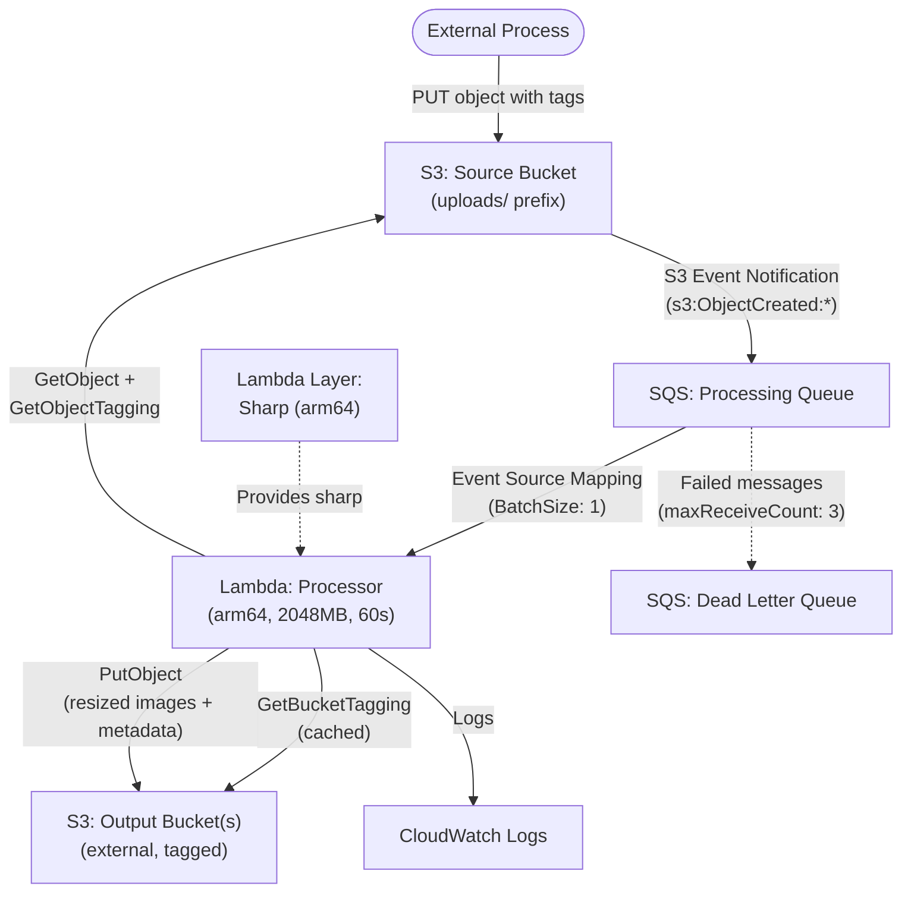
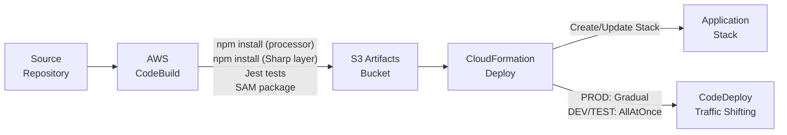

# Architecture

## Overview

Serverless Image Resizer — an event-driven image processing pipeline on AWS. Images uploaded to a source S3 bucket are queued via SQS and processed by a Lambda function using Sharp (arm64 layer) to resize into multiple size tiers, create WebP variants, extract EXIF metadata, and write outputs to dynamically determined destination buckets based on object and bucket tags.

## Application Stack



## Deployment Pipeline



## Directory Structure

```
├── application-infrastructure/         # AWS SAM application stack
│   ├── build-scripts/                  # Python scripts used during CodeBuild
│   │   ├── generate-put-ssm.py
│   │   ├── update_template_configuration.py
│   │   └── update_template_timestamp.py
│   ├── src/
│   │   └── lambda/
│   │       ├── functions/
│   │       │   └── processor/              # Lambda function source code (Node.js)
│   │       │       ├── handler.js           # SQS event handler entry point
│   │       │       ├── package.json         # Lambda function dependencies
│   │       │       ├── config/
│   │       │       │   └── settings.js      # Centralized configuration from env vars
│   │       │       └── utils/
│   │       │           ├── s3Client.js          # S3 operations wrapper
│   │       │           ├── imageProcessor.js    # Sharp resize + WebP conversion
│   │       │           ├── metadataManager.js   # metadata.json generation and merge
│   │       │           ├── bucketTagCache.js    # In-memory bucket tag cache
│   │       │           ├── pathResolver.js      # Output path resolution
│   │       │           └── logger.js            # Structured logging
│   │       └── layers/
│   │           └── sharp-arm64/
│   │               └── nodejs/
│   │                   └── package.json     # Sharp dependency (arm64/linux)
│   ├── test/
│   │   ├── jest.config.mjs                  # Jest configuration (ESM)
│   │   ├── __mocks__/
│   │   │   └── sharp.mjs                   # Sharp mock for unit tests
│   │   ├── unit/                            # Unit tests (*.jest.mjs)
│   │   └── property/                        # Property-based tests (fast-check)
│   ├── buildspec.yml                        # AWS CodeBuild build specification
│   ├── template.yml                         # AWS SAM/CloudFormation template
│   ├── template-configuration.json          # Stack parameter overrides
│   └── package.json                         # Dev dependencies (Jest, fast-check)
├── docs/                                    # Documentation
│   ├── admin-ops/                           # For Admin, Operations
│   ├── developer/                           # For Developer maintaining application
│   └── end-user/                            # For consumer of this application's output
├── scripts/                                 # Utility scripts (not part of deployment)
│   └── generate-sidecar-metadata.py
├── AGENTS.md                                # AI and developer guidelines
├── ARCHITECTURE.md
├── CHANGELOG.md
├── DEPLOYMENT.md
└── README.md
```

## Key Design Decisions

- **S3 → SQS → Lambda pipeline** replaces the previous API Gateway + Lambda architecture. SQS provides retry, DLQ, and backpressure natively.
- **Single Lambda function** handles all processing (resize, WebP, metadata). No batching/consolidation benefit for independent image processing.
- **Sharp as Lambda Layer (arm64)** separates the native binary from application code. Built during CodeBuild with `--arch=arm64 --platform=linux`.
- **Dynamic output bucket routing** via object tags (`ImageOutputBucket`, `ImageOutputPath`) decouples the resizer from any specific destination.
- **Bucket tag authorization** (`AllowImageResizerEvents=true`) acts as an opt-in gate for output buckets. Runtime verification since IAM cannot condition on bucket tags.
- **In-memory bucket tag cache** persists across warm Lambda invocations to reduce `GetBucketTagging` API calls.
- **Gradual deployments** enabled only in PROD (via CodeDeploy traffic shifting); DEV/TEST deploy all-at-once.
- **CloudWatch Alarms** and SNS notifications created only in PROD to reduce cost.
- **No upscaling** — if the original is smaller than a size tier, save at original dimensions and skip larger tiers.
- **Permissions Boundary** support is optional, controlled via a stack parameter.
