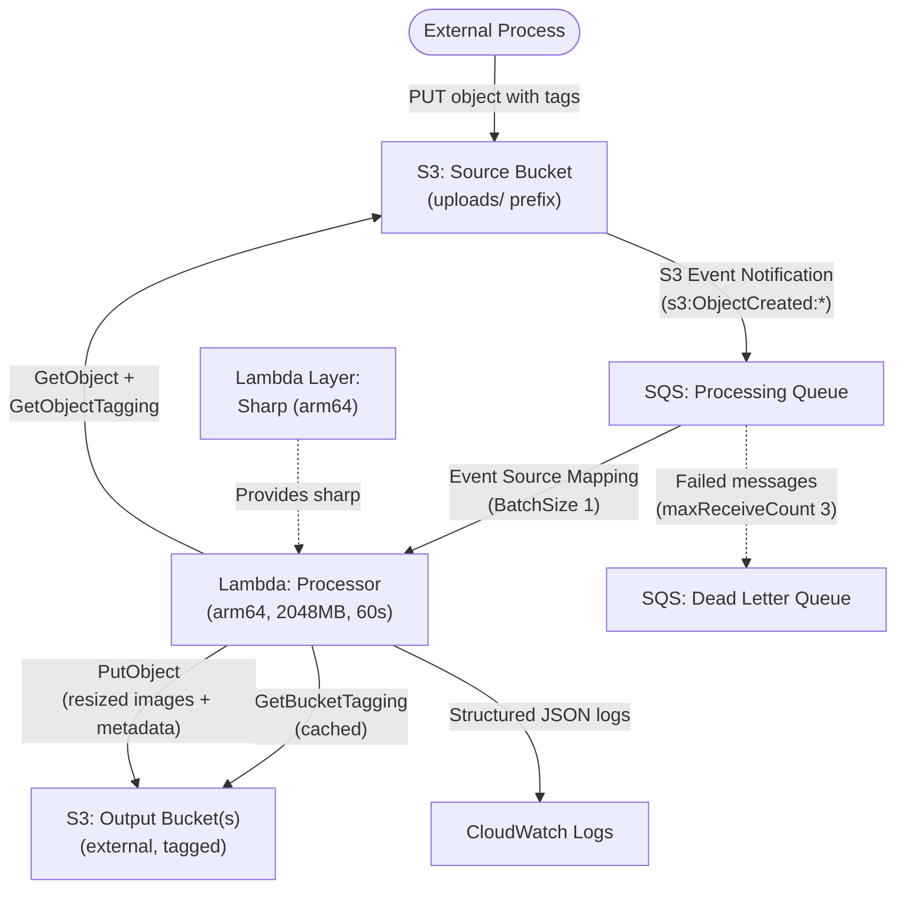

# Developer Guide

Developer documentation for the Serverless Image Resizer application. This guide covers architecture, local development, testing, module structure, and deployment.

## Architecture overview

The application follows an event-driven, serverless pipeline:



### Data flow

1. An external process uploads an image or JSON file to `s3://<source-bucket>/uploads/...` with object tags (`ImageOutputBucket`, `ImageOutputPath`, `stageId`).
2. The source bucket sends an S3 event notification (filtered to `uploads/` prefix) to the Processing Queue (standard SQS).
3. The Lambda function is triggered by the SQS event source mapping (batch size 1, `ReportBatchItemFailures`).
4. For each SQS record, the Lambda:
   - Retrieves the object and its tags from the source bucket.
   - Validates the `ImageOutputBucket` tag (required).
   - Retrieves and caches the output bucket's tags (`AllowImageResizerEvents`, `imageResizer:ImageOutputBasePrefix`).
   - Validates authorization (`AllowImageResizerEvents === 'true'`).
   - Resolves the output path using bucket tags, object tags, and stack parameters.
   - Branches on file extension: image files are resized; JSON files trigger a metadata merge.
5. Failed messages are retried by SQS visibility timeout and eventually moved to the Dead Letter Queue after 3 attempts.

### Key design decisions

| Decision | Rationale |
|----------|-----------|
| Single Lambda with SQS event source | SQS provides retry, DLQ, and backpressure natively. Simpler to debug. |
| Sharp as Lambda Layer (arm64) | Separates native binary from application code. Reduces deployment package size. |
| In-memory bucket tag cache | Persists across warm invocations. Reduces `GetBucketTagging` API calls. |
| Object tags drive routing | Decouples the resizer from any specific destination. |
| Bucket tags drive authorization | `AllowImageResizerEvents=true` acts as an opt-in gate. |
| No upscaling | If original is smaller than a tier, save at original dimensions and skip larger tiers. |
| `metadata.json` with no null values | Consumers can rely on a consistent schema. |

## Directory structure

```
application-infrastructure/
├── build-scripts/                          # Python scripts for CodeBuild
│   ├── generate-put-ssm.py
│   ├── update_template_configuration.py
│   └── update_template_timestamp.py
├── src/
│   └── lambda/
│       ├── functions/
│       │   └── processor/
│       │       ├── handler.js              # SQS event handler entry point
│       │       ├── package.json            # Lambda function dependencies (excl. sharp)
│       │       ├── config/
│       │       │   └── settings.js         # Centralized configuration from env vars
│       │       └── utils/
│       │           ├── s3Client.js         # S3 SDK wrapper (GetObject, PutObject, tagging)
│       │           ├── imageProcessor.js   # Sharp resize + WebP conversion
│       │           ├── metadataManager.js  # metadata.json generation, merge, EXIF extraction
│       │           ├── bucketTagCache.js   # In-memory cache for bucket tag lookups
│       │           ├── pathResolver.js     # Output path resolution with placeholder substitution
│       │           └── logger.js           # Configurable structured logging
│       └── layers/
│           └── sharp-arm64/
│               └── nodejs/
│                   └── package.json        # Sharp dependency only
├── test/
│   ├── __mocks__/
│   │   └── sharp.mjs                      # Sharp mock for unit tests
│   ├── jest.config.mjs                     # Jest configuration (ESM)
│   ├── unit/                               # Unit tests (*.jest.mjs)
│   └── property/                           # Property-based tests (*.jest.mjs)
├── buildspec.yml                           # CodeBuild build specification
├── package.json                            # Dev dependencies (jest, fast-check, aws-sdk-client-mock)
├── template.yml                            # SAM/CloudFormation template
└── template-configuration.json             # Stack parameter overrides
```


## Module descriptions

### `handler.js`

SQS event handler entry point. Processes each record independently and returns `batchItemFailures` for partial batch failure reporting. Orchestrates the full pipeline:

1. Parses S3 event from SQS message body.
2. Reads object tags to determine routing (`ImageOutputBucket`, `ImageOutputPath`, `stageId`).
3. Validates the output bucket is authorized via bucket tags.
4. Resolves the output path with placeholder substitution.
5. Checks file size against the configured maximum.
6. Branches on file extension: images are resized; JSON files trigger a metadata merge.
7. Checks `context.getRemainingTimeInMillis()` for timeout awareness.

Intentional skips (unauthorized bucket, oversized file, unsupported type) return success to SQS so the message is not retried.

### `config/settings.js`

Centralized configuration module. Reads environment variables with fallback defaults and exports a deeply frozen object:

| Setting | Env Var | Default |
|---------|---------|---------|
| `sizes.*` | — | `xxLarge: 3000`, `xLarge: 1920`, `large: 1000`, `medium: 800`, `small: 500`, `thumb: 250` |
| `createWebpVersion` | `CREATE_WEBP_VERSION` | `true` |
| `imageOutputBasePrefix` | `IMAGE_OUTPUT_BASE_PREFIX` | `/{stageId}/public/images` |
| `maxImageFileSize` | `MAX_IMAGE_FILE_SIZE` | `26214400` (25 MB) |
| `logLevel` | `LOG_LEVEL` | `0` |
| `stageId` | `STAGE_ID` | `''` |
| `sourceBucket` | `SOURCE_BUCKET` | `''` |

### `utils/s3Client.js`

Thin wrapper around AWS SDK v3 S3 client. Provides `getObject`, `getObjectTagging`, `getBucketTagging`, and `putObject`. Uses the SDK already available in the Lambda `nodejs24.x` runtime (no bundling required).

### `utils/imageProcessor.js`

Resizes images into up to six size tiers using Sharp. Iterates tiers from smallest to largest. For each tier where the original long side >= threshold, the image is resized proportionally. For the first tier where the original is smaller, the image is saved at original dimensions and all larger tiers are skipped. Optionally creates `.webp` variants for each resized image.

### `utils/metadataManager.js`

Handles `metadata.json` lifecycle:

- `generateMetadata()` — creates a fresh metadata object from EXIF data and size dimensions.
- `mergeMetadata()` — merges an uploaded JSON document into existing metadata (null values become empty, protected fields preserved).
- `mergeWithNewImage()` — re-upload merge: replaces technical fields (EXIF, sizes) but preserves non-empty descriptive fields.
- `extractExif()` — extracts EXIF data from an image buffer via Sharp.

All outputs follow a strict no-null contract: every field is always present and uses `""`, `{}`, or `[]` instead of null.

### `utils/bucketTagCache.js`

Module-level `Map` that caches output bucket tag lookups. Persists across warm Lambda invocations within the same execution environment. No TTL — the cache lives for the Lambda container lifetime.

### `utils/pathResolver.js`

Resolves the full output path prefix by combining a base prefix (from bucket tags or stack parameters), an optional `ImageOutputPath` from object tags, and the original file name. Handles two placeholder formats:

- `@stageId` in bucket tag values
- `{stageId}` in stack parameter values

### `utils/logger.js`

Structured JSON logger with configurable log levels (ERROR=0, WARN=1, INFO=2, DEBUG=3, TRACE=5). Outputs to CloudWatch via `console.*` methods. Includes context fields (`requestId`, `sourceKey`, `outputBucket`) in every entry. Does not log full AWS SDK responses.

## Local development setup

### Prerequisites

- Node.js 24.x (matches Lambda runtime)
- npm
- Python 3.x (for build scripts)
- AWS CLI (for manual testing against AWS)

### Install dependencies

From the repository root:

```bash
# Install dev dependencies (jest, fast-check, aws-sdk-client-mock)
cd application-infrastructure
npm install

# Install Lambda function production dependencies
cd src/lambda/functions/processor
npm install --production
cd ../../../..
```

> **Note**: The Sharp layer is built separately during CodeBuild with arm64/linux flags. You do not need to install it locally for running tests — the test suite uses a mock at `test/__mocks__/sharp.mjs`.


## Running tests

All tests use Jest with ESM support. The test configuration is at `test/jest.config.mjs`.

### Run the full test suite

```bash
cd application-infrastructure
npm test
```

This executes:

```bash
node --experimental-vm-modules node_modules/jest/bin/jest.js --config test/jest.config.mjs
```

### Run with coverage

```bash
cd application-infrastructure
npx jest --config test/jest.config.mjs --ci --coverage
```

### Run a specific test file

```bash
cd application-infrastructure
npx jest --config test/jest.config.mjs test/unit/handler.jest.mjs
```

### Run only property-based tests

```bash
cd application-infrastructure
npx jest --config test/jest.config.mjs test/property/
```

### Test structure

| Directory | Purpose |
|-----------|---------|
| `test/unit/` | Unit tests for individual modules. Mock AWS SDK and Sharp. |
| `test/property/` | Property-based tests using fast-check. Validate universal correctness properties across generated inputs. |
| `test/__mocks__/sharp.mjs` | Sharp mock used by Jest to avoid requiring the native arm64 binary locally. |

### Writing new tests

- All new tests must be Jest files ending in `.jest.mjs`.
- Unit tests go in `test/unit/`, property tests in `test/property/`.
- Use `aws-sdk-client-mock` for mocking S3 operations.
- Use `fast-check` for property-based testing with a minimum of 100 iterations.
- Follow the existing patterns in the test directory for consistency.

## Deployment

### Pipeline overview

The application deploys through the Atlantis platform CI/CD pipeline. Each branch maps to an environment:

| Branch | Stage ID | Environment |
|--------|----------|-------------|
| `test` | `test` | TEST |
| `beta` | `beta` | PROD |
| `main` | `prod` | PROD |

Merge sequence: `dev` → `test` → `beta` → `main`

### What happens during a build

The `buildspec.yml` defines the CodeBuild phases:

1. **install** — Sets up Node.js and Python runtimes, configures npm caching, installs Python build script dependencies.
2. **pre_build**:
   - Installs Lambda function production dependencies (`src/lambda/functions/processor/`).
   - Runs `npm audit` to check for vulnerabilities.
   - Builds the Sharp layer with arm64/linux flags (`src/lambda/layers/sharp-arm64/nodejs/`).
   - Installs dev dependencies and runs the Jest test suite with coverage.
   - Creates SSM parameters via build scripts.
3. **build**:
   - Updates template timestamp (for CodeDeploy alias refresh).
   - Resolves placeholders in `template-configuration.json`.
   - Packages the SAM template via `aws cloudformation package`.

### CloudFormation template

The `template.yml` defines all AWS resources:

- **SourceBucket** — S3 bucket with event notifications to the processing queue, lifecycle rules for upload retention/archival.
- **ProcessingQueue** — Standard SQS queue (visibility timeout 360s, redrive to DLQ after 3 failures).
- **DeadLetterQueue** — SQS queue with 14-day message retention.
- **SharpLayer** — Lambda Layer containing the Sharp native binary for arm64.
- **ProcessorFunction** — Lambda function (nodejs24.x, arm64, 2048 MB, 60s timeout) with SQS event source.
- **LambdaExecutionRole** — IAM role with least-privilege permissions for S3, SQS, and CloudWatch Logs.

### Deployment configuration

Stack parameters are managed in `template-configuration.json`. Key parameters:

| Parameter | Description |
|-----------|-------------|
| `CreateWebpVersion` | Enable/disable WebP variant generation (`true`/`false`) |
| `ImageOutputBasePrefix` | Base S3 prefix for outputs (supports `{stageId}` placeholder) |
| `MaxImageFileSize` | Maximum image file size in bytes |
| `FunctionTimeOutInSeconds` | Lambda timeout (default 60, max 900) |
| `FunctionMaxMemoryInMB` | Lambda memory (default 2048) |
| `SourceBucketRetentionInDaysForPROD` | Upload retention for PROD (default 5, 0 = archive mode) |
| `SourceBucketRetentionInDaysForDEVTEST` | Upload retention for DEV/TEST (default 1) |

### Deploying changes

All deployments go through GitOps. Push to the appropriate branch to trigger the pipeline:

```bash
git switch dev
# Make changes, commit
git switch test
git merge dev
git push
# Pipeline deploys to test environment
```

Do not deploy manually via `sam deploy` or the AWS Console. Use the Atlantis platform scripts for pipeline management.

## Related documentation

- [End-User Guide](../end-user/README.md) — Upload instructions, tag formats, supported formats
- [Admin-Ops Guide](../admin-ops/README.md) — Error monitoring, DLQ inspection, lifecycle management
- [Architecture](../../ARCHITECTURE.md) — High-level architecture overview
- [Deployment](../../DEPLOYMENT.md) — Pipeline setup and deployment workflow
- [Changelog](../../CHANGELOG.md) — Version history
